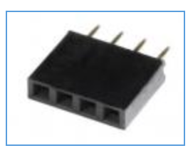
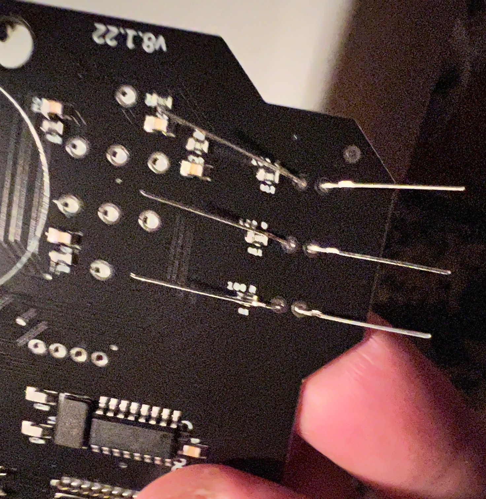

# corncon2022

Source code, build and assembly instructions

# Assembly of badge:

## Componets in your bag:
* 1 PCB board with all surface mounted components installed
* 7 LEDS 
* 6 Buttons 
* IC Socket 
* IC - shift register 
* 2 female headers  
* 1 male header
* 1 LCD screen 
* 1 18650 Battery Holder 
* 1 18650 Battery
* 1 18650 Battery USB charger

## Assembly:
### LEDS
* place each led into the 7 LED locations on the top of the board ensuring the long leg of the LED through the whole labeled 'long'
* bend each of the 2 legs of the LED out such that if you turn the badge over they do not fall out.
* Solder each led of the 7 LEDs.

### Buttons
* place buttons in the 6 button wholes
* solder one leg of each button from the top of the board.
* Flip over board and solder both leds of each button

### IC Socket
* place IC Socket in the holes on the top of the pcb board with the notch towards the word notch
* Hold the IC socket in place and flip over the board, bend out legs in the 4 cornerns.
* Release your hold (socket should stay in place), solder all pins.

### Female headers
* Place the long and short female headers into the top of the board, holding the headers flip over the board and set down on solder table
* solder 1 lead on both the long and short header
* pick up the board and ensre the headers are straight, if not heat up the solder join and move the header straight
* solder the remaining header pins.

### Male header
* Place the 4 pin male header into the 4 pin female header.
* place the lcd pins into the longer female header and have the male header go through the 4 holes on the other side of the lcd
* solder the 4 pins to the lcd.

### Battery holder
* with the pcb board faing down: take the negative side of the battery holder (black wire) and place in the top left battery hole.
* Solder in place
* Take the postivie side of the battery holder (red wire) and place in the bottom right battery hole.
* Solder in place
* Turn the battery holder 180 degress, peal off tap covery from double sided tape.
* Press battery holder in place 

# Usage:

# Build:

